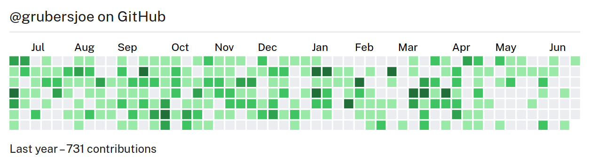

# React GitHub Calendar

[](https://github.com/grubersjoe/react-github-calendar/actions/workflows/test.yml)

A React component to display a GitHub contributions graph based on
[`react-activity-calendar`](https://github.com/grubersjoe/react-activity-calendar) and
[`github-contributions-api`](https://github.com/grubersjoe/github-contributions-api).



[Demo and documentation](https://grubersjoe.github.io/react-github-calendar/)

## Installation

```shell
npm install react-github-calendar
```

## Usage

```tsx
import GitHubCalendar from 'react-github-calendar';

const App = () => <GitHubCalendar username="grubersjoe" />;
```

## FAQ

### Is server side rendering (SSR) supported?

Yes. However, not with this component because it fetches data client-side. For SSR support, you can
fetch the GitHub contribution data from a suitable
[API](https://github.com/grubersjoe/github-contributions-api) server-side and pass it on to the
internally used [`react-activity-calendar`](https://github.com/grubersjoe/react-activity-calendar)
component.

### Why is Create React App unsupported?

Create React App (CRA) is considered
[abandoned](https://github.com/facebook/create-react-app/discussions/11086), and you probably should
not use it anymore (more
[background](https://github.com/facebook/create-react-app/issues/11180#issuecomment-874748552)).
Using this component inside CRA will lead to errors for reasons described in issue
[#105](https://github.com/grubersjoe/react-activity-calendar/issues/105) of
`react-activity-calendar`. This repo is not for CRA support questions. If you encounter issues, you
need to fix those yourself given the maintenance state of CRA. Personally, I would recommend using
[Vite](https://vitejs.dev/) instead of CRA.

## Development

Start watch mode for the library first:

```shell
npm install
npm dev
```

Then start watch mode of example page:

```shell
cd example
npm install
npm dev
```

Open http://localhost:3000.

## Publish a new release

```shell
npm publish --dry-run

# When you're happy
npm publish --access=public
```

### Update demo page

```shell
npm run deploy
```
